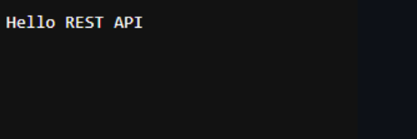

# Experiment 2: Node.js HTTP Server

*Course Outcome (CO1):* Understand how to create a basic HTTP server using Node.js and handle HTTP requests.

---

## Screenshots

Here’s a preview of the app:



## Objective

- Create a basic Node.js HTTP server.  
- Return "Hello REST API" as a response in the browser.

---

## Prerequisites

- Node.js and npm installed.  
- Terminal / Command Prompt / VS Code or any code editor.  

---

## Step 1: Create Project Folder

```bash
# Navigate to Desktop or desired folder
cd Desktop

# Create project folder
mkdir node-http-server
node server.js

# Go into the folder
cd node-http-server
